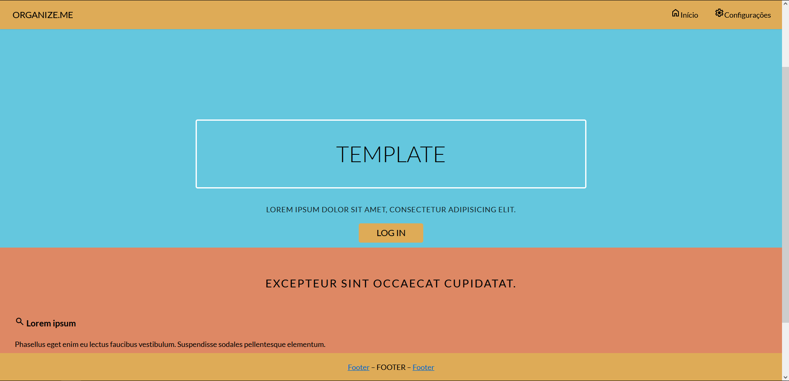
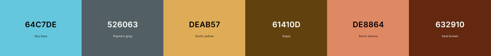

# Template padrão do site

## Design

### [temp/index.html](temp/index.html)

Detalhe os layouts que serão utilizados. Apresente onde será colocado o logo do sistema. Defina os menus padrões, entre outras coisas.

## Cores

## Tipografia

[https://fonts.google.com/specimen/Lato](https://fonts.google.com/specimen/Lato)

## Iconografia

[https://fonts.google.com/icons](https://fonts.google.com/icons)
